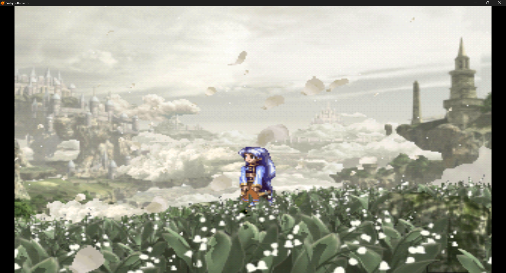

# ValkyrieRecomp



A native PC recompilation project for **Valkyrie Profile (PlayStation, USA)**,
built with [PSXRecomp](https://github.com/mstan/psxrecomp) and
[recomp-ui](https://github.com/mstan/recomp-ui).

> **Status:** Work in progress / compatibility testing.

## Features

- Native Windows executable
- Multi-disc support for Disc 1 and Disc 2
- 4:3 original aspect ratio and optional 16:9 widescreen
- OpenGL and software rendering options
- Controller support
- Memory card support
- Launcher-based disc selection
- OpenBIOS support through PSXRecomp

## Supported game

| | |
|---|---|
| Game | Valkyrie Profile |
| Region | USA / NTSC-U |
| Players | 1 |
| Disc 1 serial | SLUS-01156 |
| Disc 2 serial | SLUS-01179 |
| Original publisher | Enix |
| Original release | 2000 |

## Legal

This repository **does not include the original game disc images** or a retail
PlayStation BIOS. You must provide your own legally obtained copy of the game.

Disc images, saves, local BIOS files and build outputs are excluded by
`.gitignore` and must not be committed to this repository.

## Getting the source

Clone the repository with its submodules:

```bash
git clone --recursive <repository-url>
cd ValkyrieRecomp
```

If you already cloned it without submodules:

```bash
git submodule update --init --recursive
```

## Disc setup

The project expects the two USA discs at these relative locations when building
or testing locally:

```text
disc/Disc1/Valkyrie Profile (USA) (Disc 1).cue
disc/Disc2/Valkyrie Profile (USA) (Disc 2).cue
```

The `disc/` directory is intentionally ignored by Git.

## Building

A typical Release build uses CMake and Ninja:

```bash
./psxrecomp/tools/ci/build_emitters.sh
python3 psxrecomp/psxrecomp_cli.py generate \
  --config game.toml --project-root . \
  --disc "disc/Disc1/Valkyrie Profile (USA) (Disc 1).cue"
cmake -S . -B build-release -G Ninja -DCMAKE_BUILD_TYPE=Release
cmake --build build-release --target psx-runtime
```

On Windows, use an environment with the required compiler/toolchain and
PowerShell 7 where required by the project scripts.

## Widescreen

The launcher currently offers:

- **4:3** — original aspect ratio
- **16:9** — optional widescreen mode

## Known issues

- Compatibility and performance testing across different PCs is still ongoing.
- Some framework/runtime behavior may differ depending on hardware and drivers.
- Mid-session disc swapping may still depend on the current PSXRecomp runtime
  implementation; disc selection between runs is supported by the launcher.

## Releases

Prebuilt binaries are distributed through the repository's **Releases** page.
Build directories and executables generated locally are not stored in the main
source tree.

## Framework

This project uses the following repositories as Git submodules:

- [mstan/psxrecomp](https://github.com/mstan/psxrecomp)
- [mstan/recomp-ui](https://github.com/mstan/recomp-ui)

Keep the pinned submodule revisions when creating reproducible releases.
